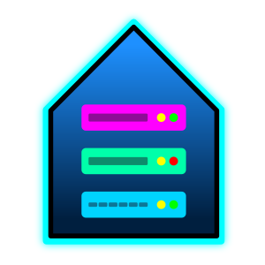

# Your First Homelab Made Simple

Homelab advice can leave you with twenty open tabs and no idea what to do first.
[MyFirstHomelab.com](https://myfirsthomelab.com) gives you one path from an old
PC to a small, working homelab.

The guide installs Proxmox VE, creates a Debian LXC, runs a few Docker apps,
and then deliberately breaks one. Rolling it back is the important bit: you
finish with a working server and proof that a mistake does not have to mean
starting over.

  

[Start the guide](https://myfirsthomelab.com/start-here/what-youre-building/)

## Feedback

Spotted an unclear step, stale link, or command that no longer matches its
upstream documentation? [Open an issue](https://github.com/Backroads4Me/my-first-homelab/issues).
Pull requests are welcome too.

## Support

My First Homelab is free and open source. If it helped you, starring the
repository makes it easier for another beginner to find. Sponsorships are
appreciated, but never expected.

